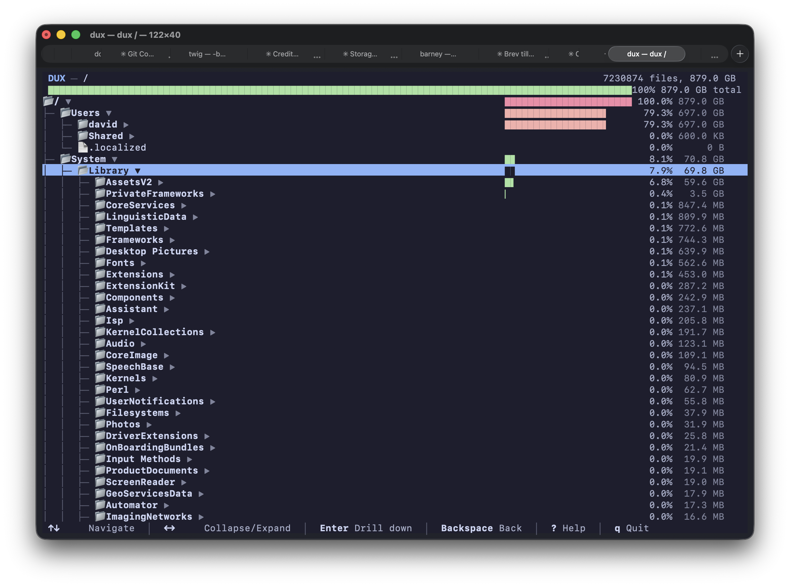

# DUX - Interactive Terminal Disk Usage Analyzer

An interactive, DaisyDisk-like terminal disk usage analyzer with rich 24-bit color UI, Unicode graphics, and drill-down navigation.



## Features

- **Parallel scanning** using jwalk for fast filesystem traversal
- **24-bit RGB colors** with Catppuccin-inspired dark theme
- **Unicode graphics**: Box drawing, partial blocks for smooth size bars, folder icons
- **Interactive navigation**: Drill down into directories, expand/collapse, keyboard shortcuts
- **Real-time progress** with animated spinner during scanning

## Installation

### From crates.io

```bash
cargo install dux-cli
```

### From Homebrew (macOS/Linux)

```bash
brew tap mjukis-ab/tap
brew install dux
```

### From source

```bash
git clone https://github.com/mjukis-ab/dux
cd dux
cargo install --path dux-cli
```

## Development

The macOS app implementation plan is in the [roadmap](ROADMAP.md), with its
normative cleanup and privacy boundary in the [security design](SECURITY_DESIGN.md)
and accepted technical decisions in the
[architecture decision records](docs/adr/README.md).

The current macOS checkpoint is a menu-bar helper with read-only user-storage
analysis and separately confirmed maintenance of DUX-owned storage. It includes
cached startup-disk pressure, an explicit Home scan, Explorer, configurable
pressure thresholds, configurable conditional menu-bar visibility, Launch at
Login, notification authorization Settings, an exact snapshot-retention limit,
and truthful storage-access onboarding. The snapshot limit is policy for later
idle retention—not an immediate clear command or a hard physical ceiling—and
changing it never touches files outside DUX’s private storage. Full Disk Access
is optional: broader guidance appears only after a measured Home-coverage gap
and an explicit request, while its bounded check reports observed access rather
than inventing a macOS permission status.
Notification permission is also optional and explicit; this version schedules
and delivers no alerts. Broader recommendations, notification delivery, AI
explanations, and cleanup of user-owned storage remain later roadmap milestones.

The repository also contains a fail-closed local Developer ID/notarization
workflow. It deliberately rejects the temporary app identity; producing a real
artifact remains gated on Milestone 9's frozen production bundle ID, Apple team,
signing identity, and Keychain-backed notarization credentials.

The macOS app embeds the matching universal CLI and can install, upgrade,
reinstall, or remove that companion from Settings at the fixed
`~/.local/bin/dux` path. Every change is explicitly confirmed; DUX leaves
unmanaged files and shell configuration untouched. Homebrew, crates.io, and
source installations remain supported independently. Current app and CLI
builds also share the scan-scope lease introduced by schema v17: exact,
ancestor, and descendant scans cannot overlap across processes, while
cache-only CLI browsing does not take a lease. If a scan is already active,
retry after it finishes; older binaries that encounter a newer database remain
read-only and should be upgraded rather than forced through the compatibility
boundary.

The TUI cache is now engine-owned beneath the fixed marker-validated
`~/Library/Caches/Dux/scan-cache-v1` child. Legacy cache siblings are never
adopted or cleared. **Storage & Privacy** includes this private cache as a
separate chart share and offers an exact, separately confirmed cache-only
clear; that action cannot touch AI records, history, snapshots, settings, or
user files and makes no promise about resulting free space.

The same Settings pane separately offers **Clear older snapshots**. Its
short-lived confirmation covers only exact DUX snapshots outside the latest
two for each scanned root and not held by an active review, together with
already-retired snapshot residuals. Recent snapshots and active Explorer
reviews remain protected. Orphans, temporary maintenance data, history, cache,
AI content, settings, legacy cache files, and user files are excluded. DUX
remeasures once after an uncertain outcome and never retries the deletion.

**Storage & Privacy** may also report possible older setup remnants. This is a
bounded name-only diagnostic of direct sibling entries matching an old DUX
stage grammar. Their ownership and size are unknown, they are excluded from
all charts and totals, and DUX provides no removal action for them.

```bash
# Build and run directly from the repo
cargo run -p dux-cli

# Run with arguments
cargo run -p dux-cli -- /path/to/directory

# Build release binary
cargo build --release -p dux-cli
# Binary at: target/release/dux
```

## Usage

```bash
# Analyze current directory
dux

# Analyze specific path
dux /path/to/directory

# Limit scan depth
dux -m 3 /path

# Follow symbolic links
dux -f /path

# Cross filesystem boundaries
dux -x /path

# Inspect the shared durable engine in human-readable form
dux status
dux history --limit 20

# Stable, versioned machine-readable inspection
dux status --json
dux history --json --limit 20
dux scan-detail --scan-id SCAN_ID --json
dux candidates --scan-id SCAN_ID --json
dux cleanup-history list --json

# Record review intent only; this never performs cleanup
dux review-state --scan-id SCAN_ID --candidate-id CANDIDATE_ID \
  --command select --json
```

The JSON contract, pagination, and privacy/compatibility guarantees are
documented in [docs/CLI_JSON.md](docs/CLI_JSON.md). Use `dux ./status` or
`dux -- status` when a directory literally has a reserved command name.

## Keyboard Navigation

| Key | Action |
|-----|--------|
| `↑`/`k` | Move up |
| `↓`/`j` | Move down |
| `→`/`l` | Expand directory |
| `←`/`h` | Collapse directory |
| `Space` | Toggle expand/collapse |
| `Tab`/`Shift-Tab` | Switch views |
| `Enter` | Drill down into directory |
| `Backspace`/`Esc` | Go back |
| `v` | Toggle multi-selection |
| `d` | Delete selected item(s) |
| `o` | Reveal selected item in Finder (macOS) |
| `r` | Rescan directly from the filesystem |
| `?` | Show help |
| `q`/`Ctrl+C` | Quit |

## License

MIT
